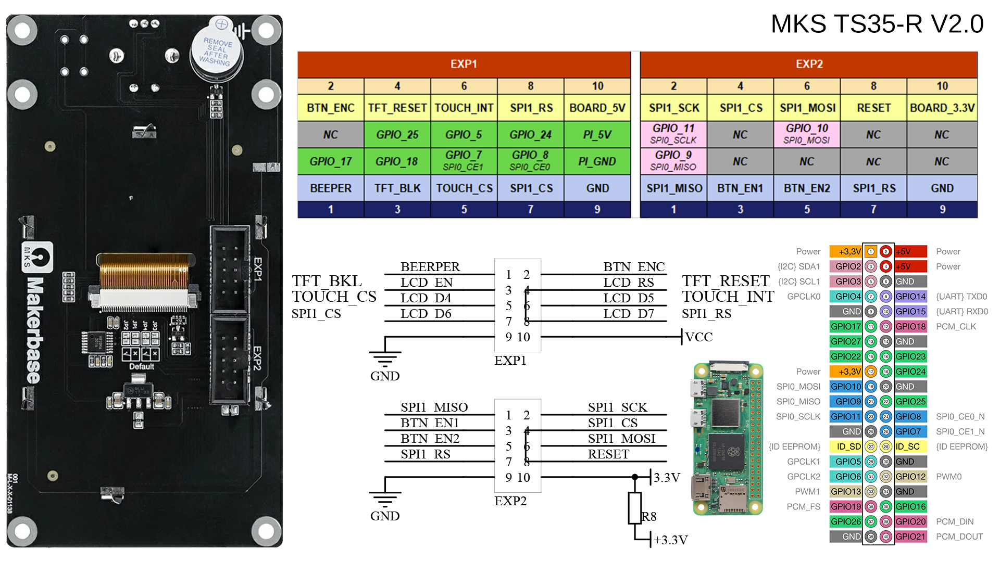

# meshtastic-screen

Écran de commande tactile pour un futur nœud **Meshtastic LoRa**, basé sur un
**Raspberry Pi Zero 2 W** et un écran **MKS TS35-R V2.0** (3.5" 480×320).

L'interface est développée en **C avec LVGL** et rendue directement sur le
framebuffer (`/dev/fb0`), sans serveur graphique (OS en version *Lite*).

> État actuel : base matérielle (affichage + rétroéclairage + tactile) validée.
> Radio LoRa **opérationnelle** : SX1262 détecté par `meshtasticd`, nœud Meshtastic
> EU_868 actif (cf. [Radio LoRa](#radio-lora-sx1262)). Reste à brancher l'UI LVGL
> sur l'API du nœud (port 4403) en remplacement du backend factice.

---

## Matériel

| Élément        | Détail |
|----------------|--------|
| Calculateur    | Raspberry Pi Zero 2 W (hostname `bq-lora`) |
| OS             | Raspberry Pi OS **Lite 64-bit, trixie** (noyau 6.12) |
| Écran          | MKS TS35-R V2.0 — 480×320, contrôleur **ILI9488** (SPI) |
| Tactile        | **XPT2046** résistif (SPI) — driver Linux `ads7846` |
| Radio LoRa     | Waveshare **Core1262-868M** (puce **SX1262**, 868 MHz) sur SPI1 |
| Extras         | Beeper (GPIO17), rétroéclairage BLK (GPIO18) |

### Câblage (bus matériel SPI0)

Les labels « SPI1 » sérigraphiés sur l'écran correspondent en réalité au
**SPI0** du Pi (GPIO 7/8/9/10/11). Branchement groupé par connecteur de l'écran.



Le schéma ci-dessus reprend le sens de branchement EXP1/EXP2 et les numéros
de broche physique du GPIO Pi correspondants ; les tableaux qui suivent
listent chaque signal avec sa GPIO logique et son rôle.

**EXP1 :**

| Signal écran | GPIO Pi | Broche physique | Rôle |
|--------------|---------|-----------------|------|
| spi1_cs   | GPIO8  | 24 | CE0 → écran (`spi0.0`) |
| touch_cs  | GPIO7  | 26 | CE1 → tactile (`spi0.1`) |
| spi1_rs   | GPIO24 | 18 | DC (data/command) |
| tft_reset | GPIO25 | 22 | Reset écran |
| touch_int | GPIO5  | 29 | PENIRQ tactile |
| tft_blk   | GPIO18 | 12 | Rétroéclairage (BLK) |
| beeper    | GPIO17 | 11 | Buzzer |
| board_5v  | 5V     | 2 (ou 4) | Alimentation écran |
| gnd       | GND    | 6 (ou 9/14/20/25/30/34/39) | Masse |

**EXP2 :**

| Signal écran | GPIO Pi | Broche physique | Rôle |
|--------------|---------|-----------------|------|
| spi1_sck  | GPIO11 | 23 | SCLK |
| spi1_mosi | GPIO10 | 19 | MOSI |
| spi1_miso | GPIO9  | 21 | MISO |

> ⚠️ **Alimentation 5V mais logique 3.3V.** Vérifier que les lignes qui
> reviennent vers le Pi (`spi1_miso`/GPIO9 et `touch_int`/GPIO5) ne dépassent
> pas 3.3V.
>
> ⚠️ **Fiabilité des contacts tactiles.** `touch_int` (GPIO5) et `spi1_miso`
> (GPIO9) sont les deux lignes critiques du tactile — l'écran (write-only) ne se
> sert jamais du MISO, donc un MISO mal connecté donne « IRQ OK mais aucun
> point ». Sur fils dupont, ces contacts lâchent facilement à la manipulation :
> les fiabiliser (soudure / nappe / colle chaude) évite les rechutes.

### Accès SSH par USB (gadget ethernet)

En plus du WiFi, le Pi est configuré en **gadget USB ethernet** (`dwc2` +
`g_ether`) : relier le **port USB *data*** du Pi (micro-USB du milieu, marqué
`USB`, pas `PWR IN`) à un port USB du PC donne un accès `ssh bqlora` filaire,
indépendant du WiFi. Alimenter le Pi par le port `PWR IN` en parallèle pour
éviter tout manque de courant.

---

## Configuration système (Pi)

L'ILI9488 n'est pas supporté nativement par `fbtft`, mais le driver **`ili9486`
le pilote correctement**. Le rétroéclairage (`led_pin=18`) est **indispensable** :
sans lui l'écran reste noir alors que le rendu fonctionne.

Ajouter le contenu de [`config/config.txt.append`](config/config.txt.append) à la
fin de `/boot/firmware/config.txt`, puis redémarrer.

Vérification après reboot :

```bash
ls /dev/fb*                                   # /dev/fb0 attendu
dmesg | grep -iE 'fb_ili9486|ads7846'         # init driver + tactile
# test couleur (vert plein écran), le rétroéclairage doit être allumé :
python3 -c "open('/dev/fb0','wb').write(bytes([0xE0,0x07])*480*320)"
```

---

## Radio LoRa (SX1262)

Le nœud Meshtastic est constitué d'un module radio **Waveshare Core1262-868M**
(puce **SX1262** nue, 868 MHz) piloté directement par le Pi.

### Architecture

Le Core1262 n'est pas un nœud autonome : c'est un modem radio. Sur le Pi, on
fait donc tourner **`meshtasticd`** (le portage Linux natif de Meshtastic,
*portduino*), qui pilote le SX1262 en SPI et constitue un vrai nœud Meshtastic
local. L'interface LVGL se connecte à ce nœud via son **API TCP locale
(`127.0.0.1:4403`, protobuf)** — c'est elle qui remplacera à terme le backend
factice `mesh.c`. (Cette approche remplace l'ancienne idée de pont série :
inutile puisque la radio est directement sur le Pi.)

### Câblage — bus SPI1 dédié

Le bus **SPI0 est entièrement occupé** par l'écran (CE0) et le tactile (CE1).
La radio est donc placée sur le **SPI1 auxiliaire**, dont les lignes de données
(GPIO 19/20/21) sont libres. Aucune contention avec le trafic écran à 24 MHz.

> ⚠️ **Alimentation 3.3V UNIQUEMENT.** Le SX1262 est en logique 3.3V et grille
> au-delà — contrairement à l'écran qui est alimenté en 5V. Brancher le VCC du
> module sur une broche **3V3**, jamais sur 5V.

Brochage relevé sur le module (deux rangées) : `ANT, GND, CS, CLK, MOSI, MISO,
RESET, BUSY` d'un côté ; `GND, GND, RXEN, TXEN, DIO2, DIO1, GND, 3V3` de l'autre.
Le module expose **RXEN/TXEN/DIO2 séparément** (commutateur RF piloté par l'hôte)
et n'a **pas de DIO3** (TCXO interne).

| Signal module | GPIO Pi (BCM) | Broche physique | Rôle / clé meshtasticd |
|---------------|---------------|-----------------|------------------------|
| 3V3   | 3V3    | 17 | Alimentation (**3.3V**) |
| GND   | GND    | 39 | Masse (plusieurs GND sur le module, un seul suffit) |
| CLK   | GPIO21 | 40 | SCLK (via `spidev1.0`) |
| MOSI  | GPIO20 | 38 | MOSI (via `spidev1.0`) |
| MISO  | GPIO19 | 35 | MISO (via `spidev1.0`) |
| CS    | GPIO16 | 36 | Chip select → `CS: 16` |
| DIO1  | GPIO13 | 33 | IRQ radio → `IRQ: 13` |
| BUSY  | GPIO12 | 32 | Busy → `Busy: 12` |
| RESET | GPIO6  | 31 | Reset → `Reset: 6` |
| RXEN  | GPIO22 | 15 | RF RX enable → `RXen: 22` |
| TXEN  | GPIO23 | 16 | RF TX enable → `TXen: 23` |
| DIO2  | *non câblé* | — | laissé NC (commutateur RF géré par RXEN/TXEN) |
| ANT   | *antenne* | — | **ne jamais émettre sans antenne 868 MHz** |

> **Commutateur RF.** RXEN/TXEN/DIO2 étant sortis séparément et non pontés sur ce
> module, on pilote **RXEN et TXEN depuis deux GPIO du Pi** (config `RXen`/`TXen`,
> comme l'E22-900M30S) plutôt que d'utiliser `DIO2_AS_RF_SWITCH` (qui exigerait de
> souder un pont DIO2↔TXEN). DIO2 reste non câblé.
>
> Dans meshtasticd, `CS`/`IRQ`/`Busy`/`Reset`/`RXen`/`TXen` sont des **GPIO pilotés
> en libgpiod**, indépendants du chip-select matériel du spidev (qui ne fournit que
> CLK/MOSI/MISO). C'est pourquoi le CE matériel de `spidev1.0` est relogé sur
> **GPIO26 (non câblé)** dans l'overlay, pour ne pas entrer en conflit avec GPIO18
> (backlight) ni GPIO16 (CS).
>
> Le Core1262 embarque un **TCXO** alimenté par DIO3 (confirmé par la spec
> Waveshare) → `DIO3_TCXO_VOLTAGE: true` est requis ; sans ce flag la radio
> n'initialise pas.

### Mise en service

Sur une installation neuve, [`deploy/provision.sh`](deploy/provision.sh) automatise
tout ce qui suit (overlay, dépôt, install, config, région). Procédure manuelle /
de référence (validée sur Pi Zero 2 W, RPi OS trixie arm64) :

1. Ajouter l'overlay SPI1 à `/boot/firmware/config.txt` (déjà inclus dans
   [`config/config.txt.append`](config/config.txt.append)) puis redémarrer :
   ```
   dtoverlay=spi1-1cs,cs0_pin=26
   ```
   Vérifier : `ls /dev/spidev1*` → `/dev/spidev1.0` attendu.

2. Installer **meshtasticd** depuis le dépôt OBS. Il n'existe **pas** de canal
   *stable* pour Debian 13 (trixie) → on utilise **beta/Debian_13** :
   ```bash
   curl -fsSL 'https://download.opensuse.org/repositories/network:Meshtastic:beta/Debian_13/Release.key' \
     | gpg --dearmor | sudo tee /etc/apt/trusted.gpg.d/network_Meshtastic_beta.gpg >/dev/null
   echo 'deb http://download.opensuse.org/repositories/network:/Meshtastic:/beta/Debian_13/ /' \
     | sudo tee /etc/apt/sources.list.d/network:Meshtastic:beta.list
   sudo apt update && sudo apt install -y meshtasticd
   ```

3. Déposer la config radio [`config/lora.yaml`](config/lora.yaml) dans
   `/etc/meshtasticd/config.d/`, puis (re)démarrer et vérifier la détection :
   ```bash
   sudo cp config/lora.yaml /etc/meshtasticd/config.d/lora.yaml
   sudo systemctl enable --now meshtasticd
   journalctl -u meshtasticd -f      # attendu : « sx1262 init success »
   ```

4. Installer le CLI **meshtastic** (Python) et régler la région (bande 868) :
   ```bash
   sudo apt install -y pipx && pipx install meshtastic
   ~/.local/bin/meshtastic --host 127.0.0.1 --set lora.region EU_868
   ```
   Vérifier : la fréquence passe à **869.525 MHz** (LongFast, EU_868).

5. L'API TCP `127.0.0.1:4403` est alors disponible pour l'UI (cf. roadmap).

---

## Application LVGL

### Dépendances (sur le Pi)

```bash
sudo apt update
sudo apt install -y build-essential cmake git
```

### Récupération de LVGL

LVGL n'est pas inclus dans ce dépôt. Le cloner et le placer dans `app/lvgl` :

```bash
cd ~
git clone https://github.com/lvgl/lvgl.git
cd lvgl && git checkout release/v9.2 && cd ~
# dans le dépôt de ce projet :
ln -s ~/lvgl app/lvgl       # ou copier le dossier dans app/lvgl
```

### Configuration LVGL

Créer `app/lv_conf.h` depuis le template et appliquer les modifications
documentées dans [`docs/lv_conf.md`](docs/lv_conf.md).

### Build & run

```bash
cd app
cmake -B build && cmake --build build -j2
sudo ./build/meshui
```

> Le premier build sur Pi Zero 2 W prend quelques minutes (compilation de LVGL).
> Le warning `ioctl(FBIOBLANK): Invalid argument` est bénin (fbtft ne supporte
> pas le blanking).

---

## Arborescence

```
meshtastic-screen/
├── README.md
├── .gitignore
├── app/                      # appli LVGL en C (compilée en ~/meshui/build/meshui)
│   ├── CMakeLists.txt        # GLOB sur *.c
│   ├── main.c                # tick + display fbdev + touch + ui_init
│   ├── ui.c / ui.h           # toute l'UI : topbar, chat, nodes, sys, modales
│   ├── theme.h               # palette cyberpunk + polices
│   ├── mesh.c / mesh.h       # backend Meshtastic FACTICE (à remplacer)
│   ├── sys.c / sys.h         # infos système + actions privilégiées + WiFi async
│   ├── touch.c / touch.h     # pilote tactile maison (evdev + affine + lissage)
│   └── calib.c / calib.h     # calibrage 5 points moindres carrés
├── config/
│   ├── config.txt.append     # overlays fbtft + ads7846 + pwm + dwc2 + spi1 (LoRa)
│   └── lora.yaml             # config meshtasticd SX1262 (-> /etc/meshtasticd/config.d/)
├── deploy/                   # à installer sur le Pi
│   ├── provision.sh          # premier-boot : build + services + sudoers
│   ├── meshui.service        # autostart de l'app
│   ├── meshui-splash.service # boot splash + détache la console
│   ├── meshui-ctl            # helper privilégié (NOPASSWD limité)
│   ├── meshui-sudoers        # règle sudoers correspondante
│   ├── backlight-init.sh     # PWM GPIO18 init
│   ├── backlight.service     # systemd oneshot pour le PWM
│   ├── usb-ncm-setup.sh      # gadget USB CDC NCM (Win11 OK)
│   └── usb-gadget.service    # systemd pour le gadget USB
├── tools/                    # utilitaires Python (pas dans le binaire C)
│   ├── splash.py             # boot splash PIL → fb0
│   ├── grab.py               # capture fb0 → PNG (dev)
│   ├── touchcal.py           # relevé tactile brut (dev)
│   └── beep.py               # tonalité piezo GPIO17 via gpiozero
└── docs/
    └── lv_conf.md            # modifs lv_conf.h (gérées par provision.sh)
```

---

## Feuille de route

### Matériel & système

- [x] Écran ILI9488 (driver `ili9486`, `/dev/fb0`) en portrait 320×480
- [x] Rétroéclairage PWM matériel sur GPIO18 (overlay `pwm`)
- [x] Tactile XPT2046 (`ads7846`) — pilote maison evdev + lissage doigt
- [x] Calibrage tactile 5 points (affine moindres carrés, persistant)
- [x] Beeper GPIO17 piloté via `gpiozero`
- [x] Gadget USB **CDC NCM** (configfs + MS OS descriptors, **Windows 11 compatible**)
- [x] Hotspot WiFi (NetworkManager `shared`)
- [x] Démarrage automatique appliance (services systemd, console détachée)

### Interface (cyberpunk minimaliste)

- [x] Identité **BugQuest // LORA** (boot splash PIL + splash app LVGL animé)
- [x] Topbar avec indicateurs **réels** : icône USB (si bail DHCP usb0), icône WiFi cyan/magenta (client/AP), horloge
- [x] Onglet **CHAT** : canaux public + chiffrés, fil de messages avec ACK, clavier virtuel
- [x] Onglet **NODES** : liste des nœuds (factice — backend Meshtastic à brancher)
- [x] Onglet **SYS** :
  - INFO (hostname, IPs wlan/usb, uptime, CPU temp, RAM, disque, alim, kernel)
  - ALIMENTATION (Éteindre / Redémarrer avec confirmation)
  - SSH (état + ACTIVER/DESACTIVER)
  - WIFI (SSID/signal + modal scan + connexion avec saisie passphrase)
  - HOTSPOT (état + toggle + QR code WiFi pour scan téléphone)
  - USB (état réel + IP côté Pi)
  - ECRAN (slider luminosité PWM, BIP test, CALIBRER)
  - APPLICATION (RELANCER MESHUI)
  - LOG SYSTÈME (`journalctl -n 30` scrollable + rafraîchir)
- [x] Modal de calibration tactile (croix rouges, 5 points)

### Sécurité

- [x] SSH par clé publique uniquement
- [x] Helper privilégié `meshui-ctl` + sudoers NOPASSWD strictement limité à ce binaire

### Déploiement

- [x] Workflow flash : Imager pour l'OS + cloud-init `user-data` complété + bundle tarball
- [x] `provision.sh` idempotent (apt + LVGL clone + lv_conf généré + build + services)
- [x] 3 voies d'accès SSH : WiFi Freebox, hotspot 10.42.0.1, gadget USB 10.42.0.1

### À faire — Intégration Meshtastic (radio SX1262)

- [x] Choix d'archi : `meshtasticd` natif + API TCP locale 4403 (cf. [Radio LoRa](#radio-lora-sx1262))
- [x] Câblage radio (SPI1 dédié) + overlay `config.txt` + `config/lora.yaml`
- [x] Module branché, **SX1262 détecté** (`sx1262 init success`), région EU_868 @ 869.525 MHz
- [x] Provisionnement automatisé (meshtasticd + config + région) dans `provision.sh`
- [ ] Pont UI ↔ API TCP 4403 en remplacement du `mesh.c` factice
- [ ] Remplacer les données factices par les vraies (nœuds, canaux, messages)
- [ ] Envoi/réception réels sur LongFast + canaux PSK chiffrés
- [ ] Gestion ACK et reprise sur erreur
- [ ] Position GPS des nœuds → vue carte hors-ligne (tuiles préchargées)

### À faire — polish & extensions

- [ ] Mode économie (extinction écran après inactivité, réveil au toucher)
- [ ] Page **Réglages** (node name, SSID/passphrase hotspot, fuseau) sans rebuild
- [ ] Carnet de contacts / nœuds favoris (alias, notes)
- [ ] Réglages radio (région, preset, hop limit) — préparation Meshtastic
- [ ] Variantes de thèmes (palettes cyberpunk alternatives)
- [ ] Graphes CPU/RAM/temp en temps réel (sparkline)
- [ ] Scanner Bluetooth (puce BT du Zero 2 W inutilisée)
